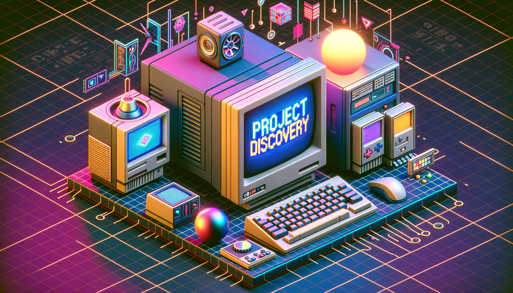
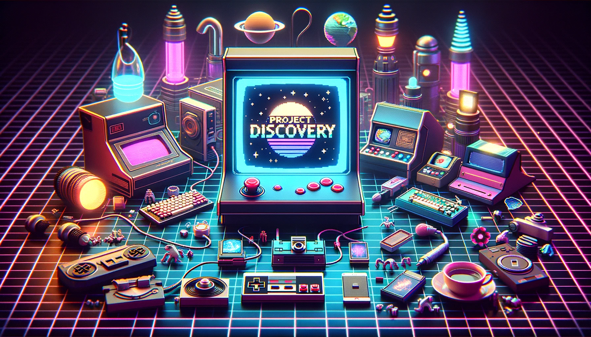

# ProjectDiscovery Wallpapers

This repository contains a collection of ProjectDiscovery wallpapers.

## Index

| | | | | |
|-|-|-|-|-|
|  |  |  |  |
|  |  |  |  |
|  |  |  |  |  |
|  |  |  |  |

You can also submit requests for various ideas under the issues section; we have an amazing design team that would love to experiment!
